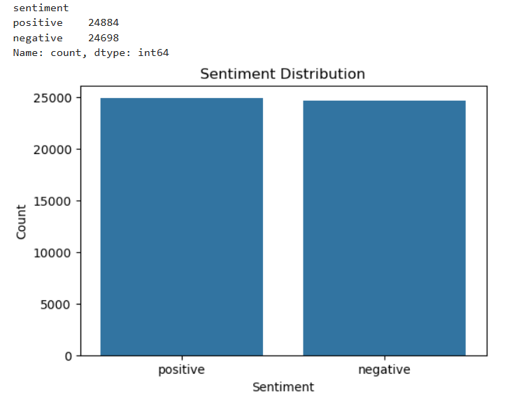
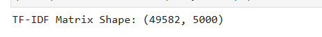
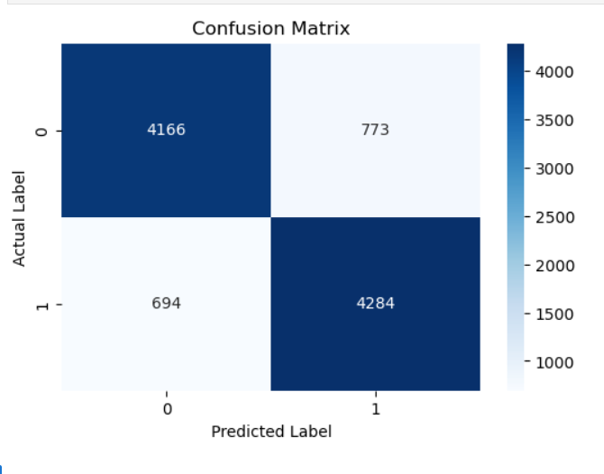
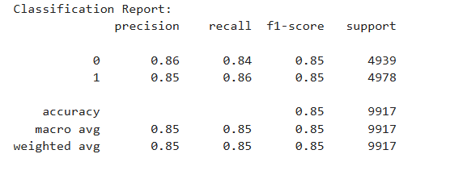

# NLP & Sentiment Analysis using TF-IDF and Naive Bayes

## Project Overview

Sentiment Analysis is one of the most widely used Natural Language Processing (NLP) applications. It involves analyzing textual data to determine whether the sentiment expressed is positive or negative.

In this project, a complete NLP pipeline was developed to preprocess movie reviews, convert text into numerical features using TF-IDF, and train a Naive Bayes classifier to automatically predict review sentiment.

---

## Objective

The primary objectives of this project are:

- Build a complete text preprocessing pipeline.
- Perform tokenization, stopword removal, and lemmatization.
- Convert text into numerical features using TF-IDF.
- Train a machine learning model for sentiment classification.
- Evaluate model performance using standard classification metrics.

---

## Dataset Information

### Dataset Name

IMDb Dataset of 50K Movie Reviews

### Dataset Source

Dataset Link:

https://www.kaggle.com/datasets/lakshmi25npathi/imdb-dataset-of-50k-movie-reviews

### Dataset Features

| Feature | Description |
|----------|------------|
| review | Movie review text |
| sentiment | Review sentiment (positive / negative) |

### Dataset Summary

- Original Records: 50,000
- Duplicate Records Found: 418
- Final Records After Cleaning: 49,582
- Missing Values: 0

---

## Technologies Used

- Python
- Pandas
- NumPy
- Matplotlib
- Seaborn
- NLTK
- Scikit-Learn
- Jupyter Notebook

---

# Project Workflow

## Step 1: Data Loading

The IMDb movie review dataset was loaded using Pandas and inspected to understand its structure and dimensions.

---

## Step 2: Data Quality Assessment

The dataset was checked for:

- Missing Values
- Duplicate Records

### Results

- Missing Values = 0
- Duplicate Records = 418

Duplicate records were removed before further analysis.

---

## Step 3: Sentiment Distribution Analysis

The distribution of positive and negative reviews was analyzed.

### Sentiment Distribution

- Positive Reviews: 24,884
- Negative Reviews: 24,698

The dataset is balanced and suitable for sentiment classification.

### Visualization



---

## Step 4: Text Preprocessing

A complete NLP preprocessing pipeline was implemented.

### Operations Performed

- Convert text to lowercase
- Remove special characters
- Remove numbers
- Tokenization
- Stopword Removal
- Lemmatization

The processed text was stored in a new column named:

```text
clean_review
```

### Sample Cleaned Reviews


---

## Step 5: TF-IDF Vectorization

The cleaned reviews were transformed into numerical feature vectors using TF-IDF (Term Frequency-Inverse Document Frequency).

### Configuration

```python
max_features = 5000
```

### Output Shape

```text
(49582, 5000)
```

### Visualization



---

## Step 6: Train-Test Split

The dataset was divided into training and testing sets.

### Split Configuration

```python
test_size = 0.20
random_state = 42
```

---

## Step 7: Model Training

A Multinomial Naive Bayes classifier was used for sentiment prediction.

### Algorithm

```python
MultinomialNB()
```

The model was trained using TF-IDF features extracted from movie reviews.

---

## Step 8: Model Evaluation

Model performance was evaluated using:

- Accuracy Score
- Confusion Matrix
- Precision
- Recall
- F1-Score

---

## Accuracy Score

```text
85.21%
```

---

## Confusion Matrix

```text
[[4166  773]
 [ 694 4284]]
```

### Visualization



---

## Classification Report

| Metric | Negative Class | Positive Class |
|----------|----------|----------|
| Precision | 0.86 | 0.85 |
| Recall | 0.84 | 0.86 |
| F1-Score | 0.85 | 0.85 |

### Classification Report Output



---

# Key Findings

- The dataset was balanced between positive and negative reviews.
- NLP preprocessing significantly improved text quality.
- TF-IDF successfully transformed text into machine-readable numerical features.
- Naive Bayes achieved strong performance with an accuracy of 85.21%.
- Precision, Recall, and F1-Score remained consistent across both classes.
- The model effectively classified unseen movie reviews as positive or negative.

---

# Project Outputs

The project generates:

- Cleaned Review Dataset
- TF-IDF Feature Matrix
- Trained Sentiment Classification Model
- Sentiment Predictions
- Performance Evaluation Metrics

---

# Files Included

```text
Project4_NLP_Sentiment_Analysis.ipynb

IMDB_Cleaned_Dataset.csv

README.md

images/
├── sentiment_distribution.png
├── cleaned_reviews.png
├── tfidf_shape.png
├── confusion_matrix.png
└── classification_report.png
```

---

# Repository Note

The original IMDb dataset is large and therefore may not be uploaded to this repository.

Dataset can be downloaded directly from:

https://www.kaggle.com/datasets/lakshmi25npathi/imdb-dataset-of-50k-movie-reviews

---

